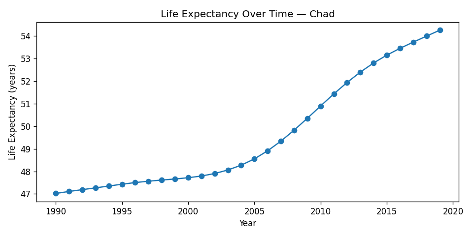
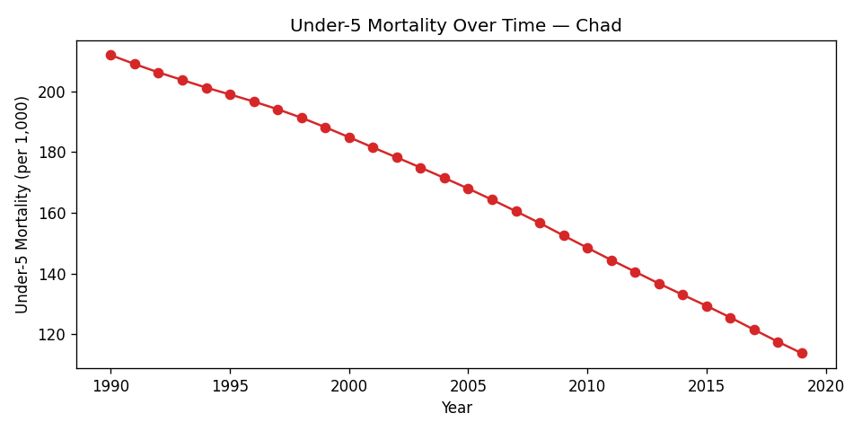
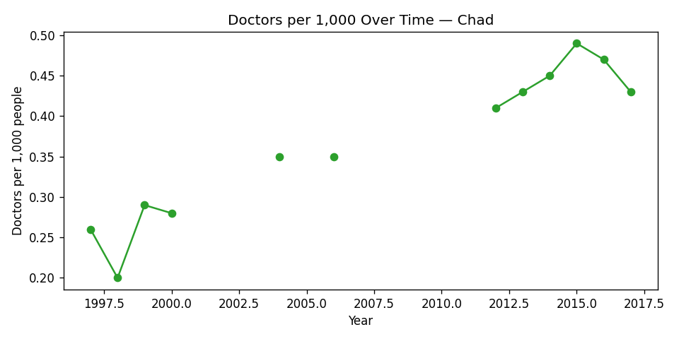
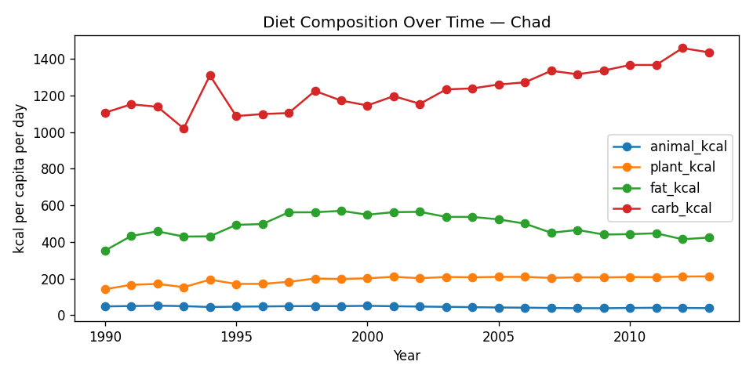

# 🇨🇺 Country Report: **Chad**

**Years Covered:** 1990.0 – 2019.0
**Latest Data Year:** 2019.0

---

## 📊 Key Indicators (Latest Year)

- **Life expectancy:** 54.25
- **Infant mortality:** 68.98
- **Under-5 mortality:** 113.67
- **Doctors per 1,000:** N/A
- **UHC coverage:** N/A
- **Basic water access:** N/A
- **Basic sanitation:** N/A
- **Clean fuel access:** N/A
- **GDP per capita:** N/A

---

## 🚻 Gender Gap in Life Expectancy

- **Latest Gap (Female − Male):** 2.83 years
- **Max gap:** 2.83
- **Min gap:** 2.35

---

## 🍽️ Diet Profile (Average kcal per capita per day)

- **Animal Kcal:** 45.23
- **Plant Kcal:** 193.95
- **Fat Kcal:** 485.20
- **Carb Kcal:** 1229.87
- **Total Fruit Consumption:** 0.00

---

## 📈 Trend Summary

- Life expectancy changed by **7.23 years** over the dataset.
- Under-5 mortality changed by **-98.30 per 1,000**.
- Doctors per 1,000 changed by **nan**.

---

## 📉 Key Trends (Charts)

_These charts are generated from the modeled analytical dataset (v_health_diet_join)._

---

_This report was auto-generated from the analytical SQL models and processed data pipeline._
