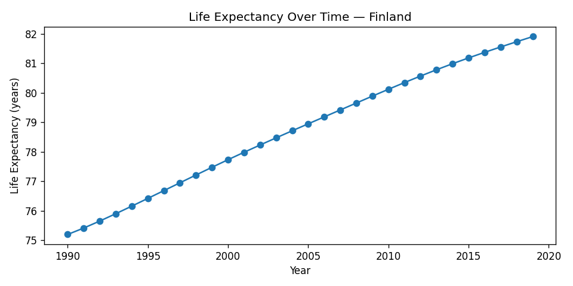
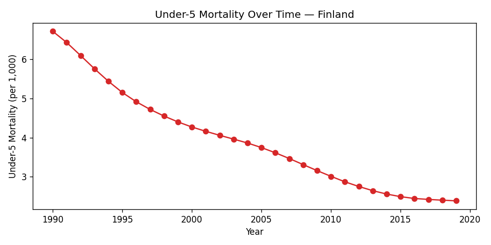
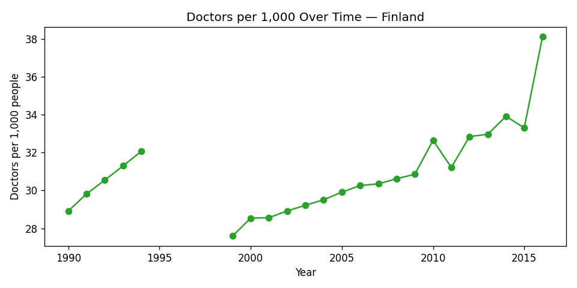
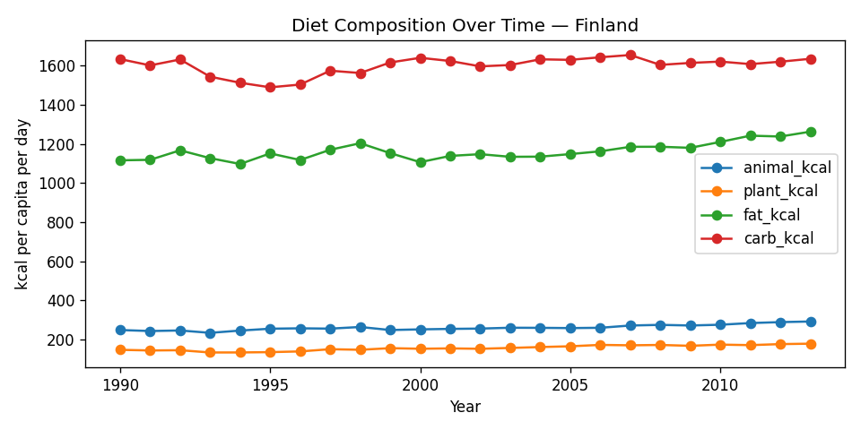

# 🇨🇺 Country Report: **Finland**

**Years Covered:** 1990.0 – 2019.0
**Latest Data Year:** 2019.0

---

## 📊 Key Indicators (Latest Year)

- **Life expectancy:** 81.91
- **Infant mortality:** 1.95
- **Under-5 mortality:** 2.38
- **Doctors per 1,000:** N/A
- **UHC coverage:** N/A
- **Basic water access:** N/A
- **Basic sanitation:** N/A
- **Clean fuel access:** N/A
- **GDP per capita:** N/A

---

## 🚻 Gender Gap in Life Expectancy

- **Latest Gap (Female − Male):** 5.63 years
- **Max gap:** 7.88
- **Min gap:** 5.63

---

## 🍽️ Diet Profile (Average kcal per capita per day)

- **Animal Kcal:** 260.75
- **Plant Kcal:** 156.69
- **Fat Kcal:** 1162.17
- **Carb Kcal:** 1599.43
- **Total Fruit Consumption:** 33.97

---

## 📈 Trend Summary

- Life expectancy changed by **6.71 years** over the dataset.
- Under-5 mortality changed by **-4.34 per 1,000**.
- Doctors per 1,000 changed by **nan**.

---

## 📉 Key Trends (Charts)

_These charts are generated from the modeled analytical dataset (v_health_diet_join)._

---

_This report was auto-generated from the analytical SQL models and processed data pipeline._
